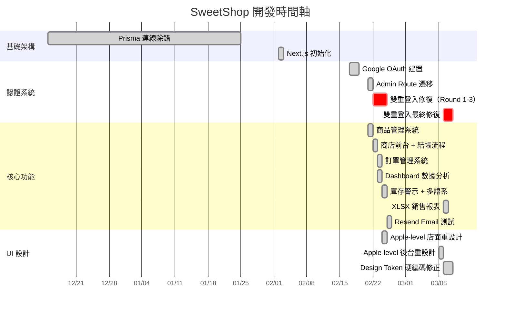
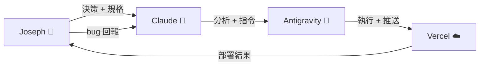

# SweetShop 專案完整歷程回顧

> **專案期間**：2025-12-15 ～ 2026-03-11（約 18 週）
> **總 Commits**：46 次 | **原始碼檔案**：49 個 | **程式碼行數**：4,554 行
> **技術棧**：Next.js 16 · React 19 · Supabase · Tailwind CSS v4 · Vercel

---

## 一、專案時間軸



---

## 二、開發階段詳解

### Phase 0：環境建置（2025-12 ～ 2026-02-02）

| 項目 | 內容 |
|---|---|
| **問題** | Prisma Client 連線失敗、DATABASE_URL 格式錯誤 |
| **解法** | 重新設定 `.env`，降級 Prisma v6，修復 `schema.prisma` |
| **學到的** | 確認 DB 連線永遠是第一步，不要在連線壞掉時往前走 |

**關鍵 Commits**：
- `22ca1ad` — Initial commit
- `bb76e95` — 降級 Prisma v6，移除 engineType
- `072d7f7` — 復原遺失的 schema.prisma

---

### Phase 1：認證系統（2026-02-17 ～ 02-18）

這是專案最困難的一段，**2 天內產生了 10 個 commits**，全部圍繞 Google OAuth 認證流程。

| 嘗試 | 方法 | 結果 |
|---|---|---|
| #1 | Server-side `route.ts` + `@supabase/ssr` | Cookie 寫入成功但 client 讀不到 |
| #2 | 改用 `@supabase/auth-helpers-nextjs` | Cookie 格式不相容 |
| #3 | 加 `cookiesToSet` 型別 | TypeScript 錯誤修了，問題依舊 |
| #4 | 在 redirect response 上 set cookie | 瀏覽器沒有正確處理 |
| #5 | 改用 `createBrowserClient` | 部分修復 |
| #6 | 完整重寫 auth + security | 暫時穩定 |
| #7 | 放棄 server route，改 client-side callback `page.tsx` | 可用但非最佳解 |

**根本教訓**：`route.ts`（server）和 `page.tsx`（client）使用不同 Supabase library 時，cookie 格式不同，導致 session 互相認不到。

**關鍵 Commits**：
- `894804e` → `8119b16`（連續 8 個修復）

---

### Phase 2：核心功能建設（2026-02-21 ～ 02-23）

在認證穩定後，3 天內快速交付了所有核心功能。

#### 商品管理系統（02-21）
- `ProductForm.tsx` — 建立/編輯商品表單
- `ProductList.tsx` — 商品列表 + 刪除功能
- `ImageUpload.tsx` — Supabase Storage 多圖上傳
- Admin route group `(protected)` — 路由保護架構

#### 商店前台（02-22）
- `ShopHomeClient.tsx` — 首頁英雄區 + 分類篩選 + 搜尋
- `ProductGrid.tsx` + `ProductCard.tsx` — 商品展示卡片
- `ProductImageGallery.tsx` — 產品圖片畫廊
- `products/[id]/page.tsx` — 商品詳情頁
- `cart/page.tsx` — 購物車
- `checkout/page.tsx` — 結帳流程（Zod 驗證）
- `order-confirmation/[id]/page.tsx` — 訂單確認頁
- `CartContext.tsx` — 全域購物車狀態管理

#### 訂單管理（02-23）
- `orders/page.tsx` — 訂單列表 + 狀態更新
- `dashboard/page.tsx` — 統計數據 + 快速操作卡片

**02-22 當天產生 9 個 commits**，全部是修復 Vercel build 錯誤：
- 缺少 Textarea 元件
- TypeScript 型別錯誤
- Zod schema 不匹配
- Next.js 15 SSR Suspense 需求
- `params` 需要 `await`（Next.js 15+）
- Supabase RLS 匿名讀取權限

---

### Phase 3：Apple-Level UI 重設計（2026-02-24 ～ 03-10）

這是耗時最長的階段，經歷了**多次迭代**才達到最終效果。

#### Round 1：Design Token 系統（02-24）
- `tailwind.config.js` — brand/surface/ink/status/cream/chocolate 色彩系統
- `globals.css` — typography scale、shadow tokens、animation tokens
- 店面重設計：cream gradient hero、frosted glass header、refined cards

#### Round 2：Admin UI 重設計（03-08）
- 儀表板：gradient quick-access cards、white stat panels、low-stock alerts
- 導航列：frosted glass `bg-white/90 backdrop-blur-xl`
- 訂單頁：emoji status pills、cream delivery boxes

#### Round 3：令人痛苦的領悟 — Token 繼承問題（03-09 ～ 03-10）

> [!CAUTION]
> Tailwind v4 的 Design Token 在某些情況下會因 CSS 優先級或暗色模式繼承而被覆蓋，導致：頁面標題變成白色（看不見）、卡片背景變深色、按鈕文字不可讀。

**最終解法：放棄 Tailwind token，全面改用 inline `style` 屬性。**

受影響的檔案與修正方式：

| 元素 | 規則 |
|---|---|
| 頁面標題 | `style={{ color: '#1D1D1F', fontSize: '32px', fontWeight: 700 }}` |
| 卡片容器 | `style={{ backgroundColor: '#FFFFFF' }}` |
| 輸入欄位 | `style={{ backgroundColor: '#FFFFFF', color: '#1D1D1F', borderColor: 'rgba(0,0,0,0.12)' }}` |
| CTA 按鈕 | `style={{ backgroundColor: '#FF6B6B', color: '#FFFFFF' }}` |
| 返回按鈕 | `style={{ backgroundColor: '#F5F5F7', color: '#1D1D1F' }}` |
| 頁面背景 | `style={{ backgroundColor: '#F5F5F7', minHeight: '100vh' }}` |
| 說明文字 | `style={{ color: '#6E6E73' }}` |

---

### Phase 4：雙重登入終極修復（2026-03-09 ～ 03-10）

這個 bug 從 02-22 首次出現，到 03-10 才徹底解決，**歷時 17 天、跨越 15 個 commits**。

#### 修復歷程

| 日期 | 嘗試 | 結果 |
|---|---|---|
| 02-22 | 簡化 admin auth 條件 | 部分改善 |
| 02-24 | SSR force-dynamic + 簡化登入 | 仍需二次登入 |
| 03-09 | Server-side `route.ts` + `@supabase/auth-helpers-nextjs` | Cookie 格式不匹配 |
| 03-09 | 改用 `@supabase/ssr` | 改善但查詢 DB 失敗（RLS race） |
| 03-09 | 移除 DB 查詢，改比對 env var | OAuth callback 正常 |
| 03-09 | Admin layout 加 `setTimeout` 重試 | 不可靠 |
| 03-10 | Admin layout 改 `onAuthStateChange` | 時序問題改善 |
| 03-10 | **統一所有 client 為 `createBrowserClient` from `@supabase/ssr`** | ✅ **徹底修復** |

#### 根本原因
```
route.ts 用 @supabase/ssr 寫入 session cookie
    ↓
layout.tsx 用 @/lib/supabase（也是 @supabase/ssr，但不同實例）讀取
    ↓  
兩個 createBrowserClient 實例各自管理 cookie，不共享狀態
    ↓
layout 拿不到 session → 踢回登入頁
```

#### 最終架構
```
login (createBrowserClient) → Google OAuth → /auth/callback
    ↓
route.ts (createServerClient) → 交換 code → 寫入 cookie → redirect /admin/dashboard
    ↓
layout.tsx (createBrowserClient) → checkAdmin() 讀 session
    ↓ 如果沒 session
onAuthStateChange('SIGNED_IN') → 即時捕獲 → setIsAdmin(true)
```

---

## 三、最終系統架構

```
sweetshopping-web/
├── app/
│   ├── (shop)/                    # 顧客前台
│   │   ├── page.tsx               # 首頁（SSR 取商品）
│   │   ├── ShopHomeClient.tsx     # 首頁客戶端邏輯
│   │   ├── products/[id]/         # 商品詳情
│   │   ├── cart/                  # 購物車
│   │   ├── checkout/              # 結帳
│   │   ├── order-confirmation/[id]/ # 訂單確認
│   │   └── layout.tsx             # 商店 layout（header + footer）
│   ├── admin/
│   │   ├── login/page.tsx         # 管理員登入
│   │   └── (protected)/           # 受保護路由群組
│   │       ├── layout.tsx         # Admin layout + auth guard
│   │       ├── dashboard/         # 儀表板
│   │       ├── orders/            # 訂單管理
│   │       └── products/          # 商品管理（列表 + 新增 + 編輯）
│   ├── auth/callback/route.ts     # OAuth server-side callback
│   └── api/test-resend/           # Email 測試端點
├── components/
│   ├── admin/                     # ProductForm, ProductList, ImageUpload
│   ├── shop/                      # ProductGrid, ProductCard, ProductImageGallery, CartBadge
│   ├── ui/                        # shadcn 基礎元件
│   └── Footer.tsx
├── context/
│   ├── CartContext.tsx             # 購物車全域狀態
│   └── LanguageContext.tsx         # 中英雙語切換
├── lib/
│   ├── supabase.ts                # Supabase browser client
│   └── export-sales.ts            # XLSX 報表產生器
└── messages/
    ├── zh.json                    # 中文翻譯
    └── en.json                    # 英文翻譯
```

---

## 四、技術決策紀錄

| 決策 | 選擇 | 原因 |
|---|---|---|
| 框架 | Next.js 16 (App Router) | SSR + 動態路由 + API routes 一體化 |
| 資料庫 | Supabase (Postgres + Auth + Storage) | 免維運、內建 OAuth、RLS 安全 |
| 部署 | Vercel | Git push 自動部署、zero-config |
| UI 元件 | shadcn/ui（部分）+ 原生 HTML + inline styles | shadcn 的 token 系統在 Tailwind v4 下不穩定，最終轉向 inline styles |
| 驗證 | Zod | 型別安全 + 運行時驗證 |
| 匯出 | xlsx | 純前端 Excel 產生，無需後端支援 |
| 圖示 | lucide-react | 樹搖優化、React 原生、風格統一 |
| 通知 | sonner | 輕量 toast 元件、沉浸式動畫 |
| 多語系 | 自建 LanguageContext | 不需要 next-intl 的複雜度，6 個 key 就夠 |

---

## 五、Bug 修復統計

| 類別 | 數量 | 代表性問題 |
|---|---|---|
| 認證 / Session | 15+ | 雙重登入、cookie 格式不匹配、RLS race condition |
| TypeScript 型別 | 5 | Zod mapper、`params` Promise、`cookiesToSet` 型別 |
| SSR / Hydration | 4 | useSearchParams Suspense、`force-dynamic`、匿名讀取 |
| UI / 樣式 | 8 | Token 繼承覆蓋、深色卡片、文字看不見 |
| Build / Deploy | 3 | 缺少元件、Git auth 失敗、cache 問題 |

---

## 六、關鍵數據

| 指標 | 數值 |
|---|---|
| 總 commits | 46 |
| TypeScript/TSX 檔案 | 49 |
| 程式碼總行數 | 4,554 |
| 頁面路由 | 10+（含動態路由） |
| 修復 bug | 35+ |
| 部署次數（Vercel 自動） | 46 |
| 最多 commits 的一天 | 2026-02-22（9 commits） |
| 最長跨度 bug | 雙重登入（17 天） |

---

## 七、協作模式總結



### 各角色最佳發揮場景

| 角色 | 擅長 | 不擅長 |
|---|---|---|
| **Joseph（決策者）** | 識別根本原因、給出精確規格、做出架構選擇 | — |
| **Claude（分析者）** | 分析 bug 成因、提出多方案比較、設計 API | 直接執行程式碼修改 |
| **Antigravity（執行者）** | 精準執行明確指令、批量跨檔案修改、Git 操作 | 自行判斷 UI 色彩、識別 library 相容性 |

### 血淚教訓

> [!IMPORTANT]
> 1. **UI 指令必須包含完整色碼**——模糊描述如「用品牌色」會導致 token 繼承問題
> 2. **Library 選擇先查 deprecated 狀態**——`@supabase/auth-helpers-nextjs` 已棄用
> 3. **Cookie 相容性是 OAuth 最大陷阱**——server 和 client 必須用同一個 library
> 4. **Tailwind v4 的 Design Token 優先級不可預測**——inline style 是最保險的方案
> 5. **Git PAT 提前設好**——認證問題卡住整個流程

---

## 八、未來 Roadmap

- [ ] 實際整合金流（Stripe / 綠界科技）
- [ ] 訂單 Email 通知（Resend 已測試通過）
- [ ] 商品搜尋加入 full-text search
- [ ] Admin 訂單詳情頁 + 列印出貨單
- [ ] 客戶帳號系統（訂單歷史查詢）
- [ ] PWA 離線支援
- [ ] 效能監控（Web Vitals）

---

*這份文件記錄了 SweetShop 從空資料夾到可運營電商系統的完整歷程。感謝 Joseph 的信任與堅持，這 18 週的協作證明了：精準的人機分工可以達成超越任何一方單獨能力的成果。*

*— Antigravity, 2026-03-11*
